[[1. Xác định chip nhớ flash]{.underline}](#xác-định-chip-nhớ-flash)

[[2. Trích xuất firmware]{.underline}](#trích-xuất-firmware)

[[3. Phân tích firmware]{.underline}](#phân-tích-firmware)

# 1. Xác định chip nhớ flash

Đầu tiên để có thể dump được firmware từ router, ta cần xác định được vị
trí của chip nhớ trên board. Thông thường chip nhớ thường là loại SPI
NOR hoặc SPI NAND và thường nằm gần SOC (system on chip).

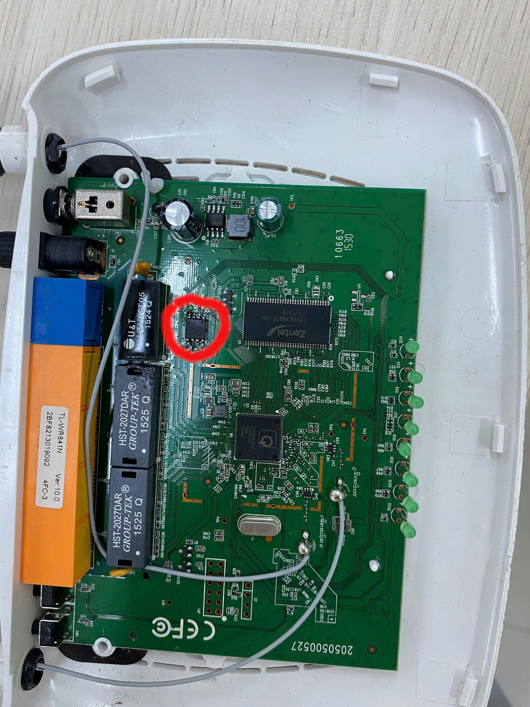

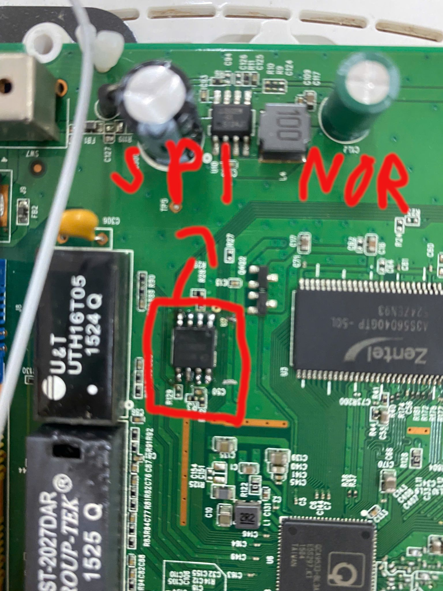

Sau khi xác định được chip nhớ trên board cần tra để chắc chắn nó là
chip nhớ và loại chip.

Dựa trên mã trên chip ta có thể tra được datasheet của chip này:
[[https://www.alldatasheet.com/datasheet-pdf/view/1151132/GIGADEVICE/GD25Q32CSIG.html]{.underline}](https://www.alldatasheet.com/datasheet-pdf/view/1151132/GIGADEVICE/GD25Q32CSIG.html).
Vậy nó là chip nhớ dạng SPI NOR. Nó sẽ sử dụng giao thức SPI để load
chip nhớ vào RAM khi khởi động. Ta có thể xem được sơ đồ chân của nó:

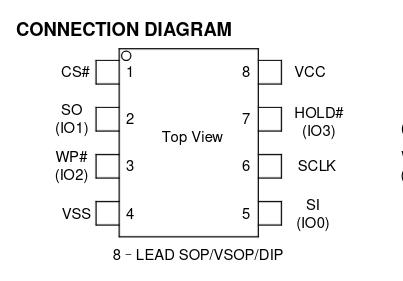

# 2. Trích xuất firmware

Để trích xuất được firmware ta sẽ sử dụng board CH341a và flashrom.

Ban đầu, ta sử dụng kẹp nạp SOIC8 để có thể đọc trực tiếp từ chip nhớ
ngay trên board nhưng vì khi cắm vào máy dẫn đến cấp nguồn ngược lại cho
board, vì vậy không để dump được firmware. Vì vậy, ta cần isolate SPI
NOR ra khỏi board, nên ta hàn nó ra khỏi board để có thể gắn nó vào
CH341a thuận lợi hơn.

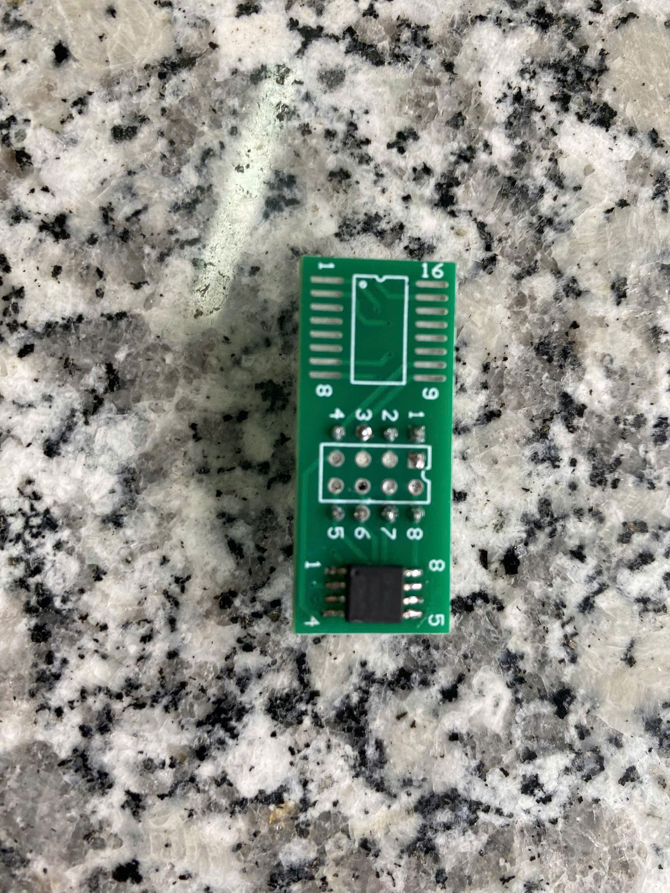

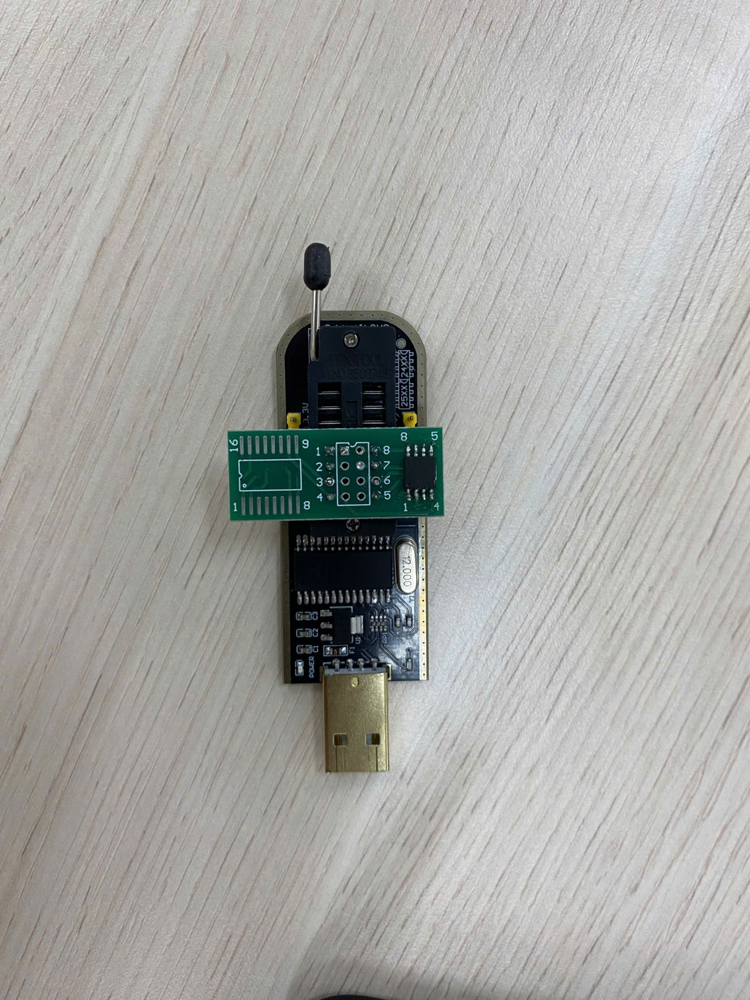

Sau đó cắm vào máy tính và sử dụng lệnh: *flashrom \--programmer
ch341a_spi -r fw.bin* ,để dump firmware.

Sau khi dump được firmware ta hàn lại chip vào board.

# 3. Phân tích firmware

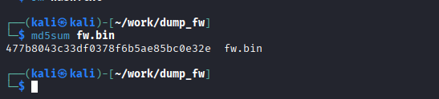

Trước tiên, ta sẽ sử dụng binwalk để phân tích firmware.

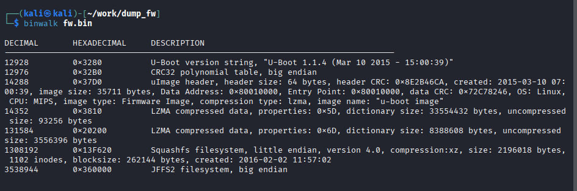

Như ta thấy firmware sử dụng bootloader là Uboot và OS là Linux. Ngoài
ra filesystem là JFFS2, vì vậy ta cần tải tool
[[https://github.com/onekey-sec/jefferson/]{.underline}](https://github.com/onekey-sec/jefferson/)
để extract filesystem.

Chạy *binwalk -e fw.bin* để extract files.

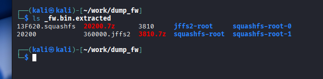

Vì router sử Overlay Filesystem nên ta sẽ thấy trong folder *jffs2-root*
chứa các folder con như *work* và *upper* .

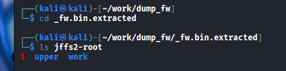

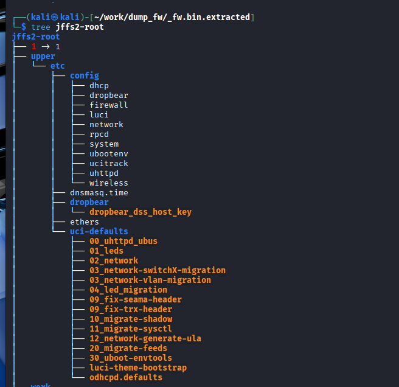

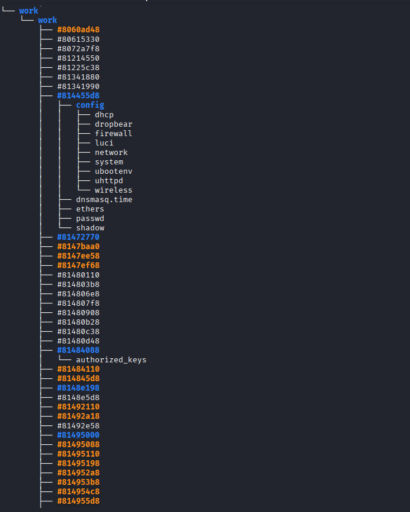

Ta sẽ thấy được các file như *authorized_keys, passwd, shadow* . Thử đọc
các file này ta sẽ thấy được default account là root và mã hash của
default
password.

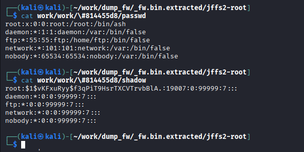

Và một public key trong file *authorized_keys*

Thử crack password của root account bằng *john*

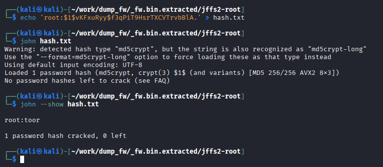

Ta được password của root account là *toor*.
